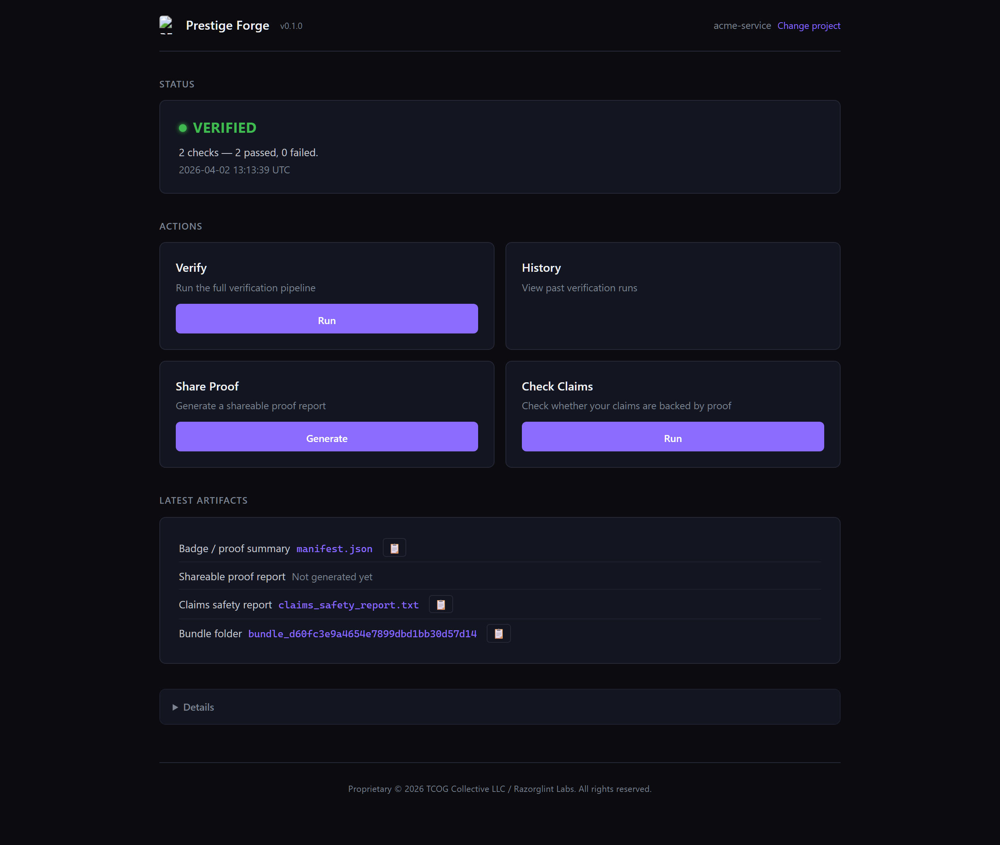
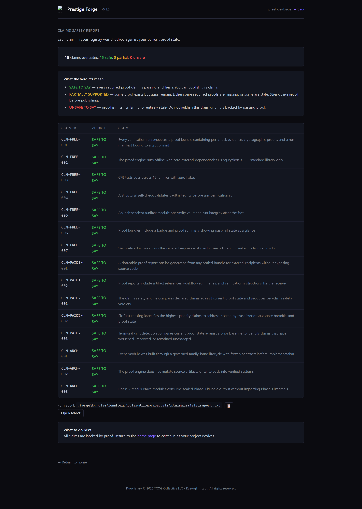

  <strong>Proof-first verification engine for builders.</strong> 
  Verify work, share proof, and check whether your claims are actually supported.

  <a href="docs/client-zero.md">Client Zero</a> •
  <a href="docs/tier-overview.md">Tier Overview</a> •
  <a href="docs/local-ui-preview.md">Local UI Preview</a> •
  <a href="examples/free/">Free Examples</a> •
  <a href="examples/paid-shareable-proof-report/">Proof Report Examples</a> •
  <a href="examples/paid-claims-safety/">Claims Safety Examples</a>

---

Prestige Forge helps builders move from **“we think this is true”** to **“we can actually prove it.”**

# Prestige Forge

**Proof-first verification engine for builders.**  
Verify work, share proof, and check whether your claims are actually supported.

**Version:** 0.1.0-beta — Source Release

---

## What Prestige Forge does

Prestige Forge helps builders move from “we think this is true” to “we can actually prove it.”

It gives you a clear ladder:

### Free layer
See proof state and verification history.

### Paid layer 1
Turn proof into a receiver-readable report you can hand to someone else.

### Paid layer 2
Check whether your outward claims are actually backed by current proof, see what is risky, and know what to fix first.

---

## Why this exists

A lot of teams can show proof artifacts.

Far fewer can answer the harder questions:

- What proof do we actually have?
- Can another person inspect it without a walkthrough?
- Are the claims we make still supported right now?
- What drifted?
- What should we fix first before we say too much?

Prestige Forge is built to answer those questions in order.

---

## Product ladder

### 1) Proof visibility
See the current proof state.

### 2) Verification history
Understand how proof was verified over time.

### 3) Shareable proof report
Hand proof to a receiver in a structured, inspectable format.

### 4) Claims safety engine
Check whether your claims are safe to say, unsafe to say, or only partially supported.

This last layer is what changes behavior. It helps catch overstatement before a client, buyer, reviewer, or auditor catches it for you.

---

## Local UI

Prestige Forge now includes a local UI — a browser-based interface that lets you run verification, view history, share proof, and check claims without using the terminal.

It runs on your machine, opens in your browser, and talks directly to the proof engine. No cloud. No accounts. Same proofs.

This is an early MVP. See [Local UI Preview](docs/local-ui-preview.md) for what it does today and what comes next.

---

## Client Zero

Prestige Forge has already been run against Prestige Forge itself.

Client Zero result:

- **15/15 claims marked SAFE TO SAY**
- proof artifacts generated across the full product ladder

That means the system has already been used on its own product claims before being positioned for external buyers.

See the [full Client Zero results](docs/client-zero.md) for the complete self-verification record.

---

## What buyers get

Depending on tier, buyers can get:

- proof visibility surfaces
- verification history
- shareable proof reports
- claims safety reports
- fix-first prioritization
- temporal drift awareness

---

## What this repo is

This is the **buyer-safe product surface** for Prestige Forge.

It is designed to show:

- what the product does
- how the tiers differ
- what kind of artifacts buyers can expect
- why the final paid tier matters

---

## What this repo is not

This repo is **not** the full internal build repository.

It does not expose:

- full governance internals
- deep constitutional history
- sensitive implementation details
- private architecture surfaces
- sovereign internal tooling

Those remain private.

---

## Tier overview

### Free
For builders who need proof visibility and verification history.

### Paid — Shareable Proof Report
For builders who need to hand proof to another person in a clean, inspectable format.

### Paid — Claims Safety Engine (Beta)
For builders who need to know whether their claims are actually supported, what drifted, and what to fix first.

---

## Example use cases

Prestige Forge is useful when a team needs to check claims made in:

- product documentation
- buyer-facing repos
- README files
- release notes
- client deliverables
- internal verification summaries
- launch materials

---

## Current status

**Prestige Forge 0.1.0-beta** — source release with local UI

---

## Get Tier 1 Beta Access

Tier 1 unlocks **Share Proof** on top of the Free layer.

**[Get Tier 1 Beta Access](https://buy.stripe.com/7sY6oBd4Z5Ba1DaeGj1ZS00)**

Beta access is fulfilled manually after purchase.

Beta pricing is currently **$49**. Planned post-beta price: **$79**.

---

## Documentation

| Document | Purpose |
|----------|---------|
| [Quickstart](docs/quickstart.md) | Get running in under five minutes |
| [Tier Overview](docs/tier-overview.md) | Detailed breakdown of free and paid tiers |
| [Client Zero](docs/client-zero.md) | Self-verification proving run results |
| [Local UI Preview](docs/local-ui-preview.md) | What the local UI does today and what comes next |

## Examples

| Tier | Folder |
|------|--------|
| Free — proof visibility | [examples/free/](examples/free/) |
| Paid — shareable proof report | [examples/paid-shareable-proof-report/](examples/paid-shareable-proof-report/) |
| Paid — claims safety (beta) | [examples/paid-claims-safety/](examples/paid-claims-safety/) |

---

## License

Proprietary. © 2026 TCOG Collective LLC / Razorglint Labs. All rights reserved. See [LICENSE](LICENSE) for details.
