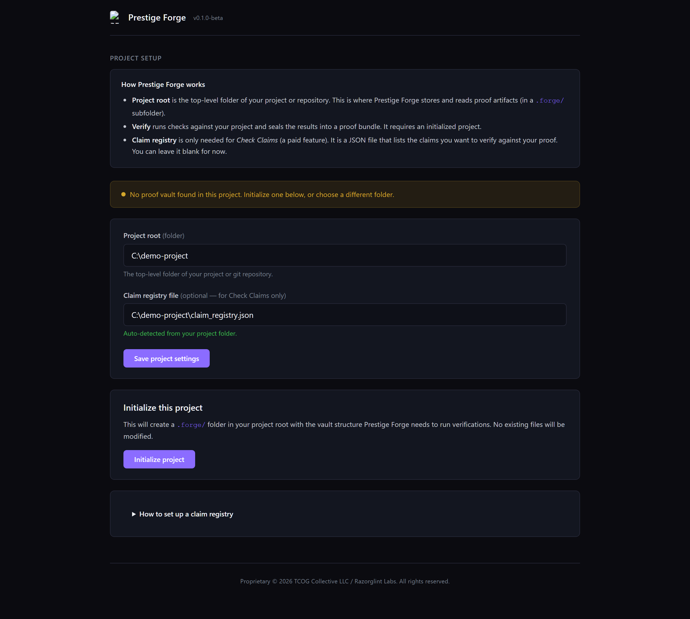
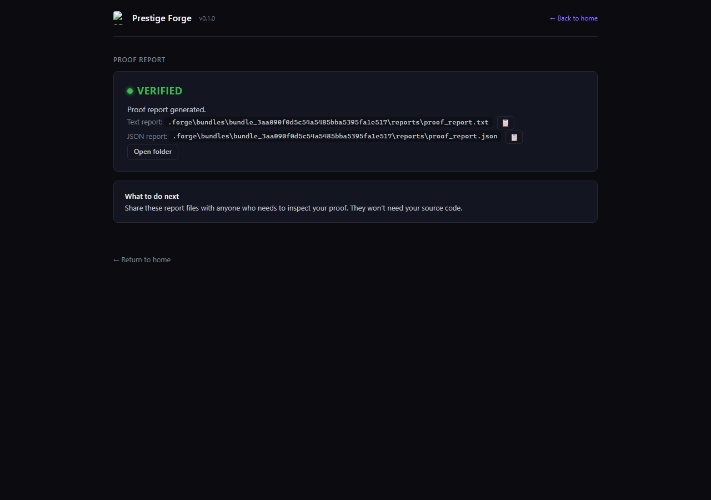
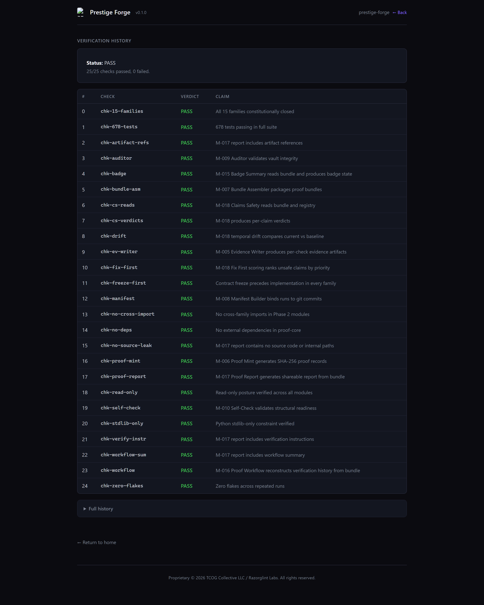

> Most systems cannot prove what they claim.  
> Prestige Forge tells you what is safe to say — and what is not.


<p align="center">
  <strong>A proof-first verification engine that tells you what a system can safely claim — and what it cannot.</strong>
</p>

<p align="center">
  <a href="docs/client-zero.md">Client Zero</a> •
  <a href="docs/tier-overview.md">Tier Overview</a> •
  <a href="docs/local-ui-preview.md">Local UI Preview</a> •
  <a href="examples/free/">Free Examples</a> •
  <a href="examples/paid-shareable-proof-report/">Proof Report Examples</a> •
  <a href="examples/paid-claims-safety/">Claims Safety Examples</a>
</p>

---

## Try this in 2 minutes

```bash
git clone https://github.com/RazorglintLabs/prestige-forge-product.git
cd prestige-forge-product

python -m forge_cli init
python -m forge_cli self-check
python -m forge_cli run
```

Then open the local UI and inspect:

- what was verified
- what proof was generated
- what claims are safe to say

No setup. No dependencies. No accounts.

---

# Prestige Forge

**A proof-first verification engine that turns system claims into verifiable truth.**

Prestige Forge evaluates what a system says about itself and returns:

- **SAFE TO SAY**
- **PARTIALLY SUPPORTED**
- **UNSAFE TO SAY**

Backed by:

- deterministic evidence
- cryptographic proof artifacts
- receiver-verifiable bundles

No dashboards.  
No “trust me.”  
**Only verifiable truth.**

---

## Why this exists

Most systems cannot be independently verified.

- Test coverage measures lines, not truth  
- Dashboards show activity, not proof  
- Documentation describes intent, not reality  

So when someone says:

> “This system is secure / compliant / production-ready”

You often cannot verify that claim from the available proof.

**Prestige Forge fixes that.**

---

## What Prestige Forge actually does

Given a repository and a set of claims, it:

1. Executes governed verification checks  
2. Generates deterministic evidence and proof records  
3. Binds results to a commit  
4. Produces a portable proof bundle  
5. Evaluates each claim with a safety verdict  

Result:

> You don’t get “it works”  
> You get **what is safe to say — and what is not**

---

## Example outcome

| Claim | Verdict |
|------|--------|
| “All endpoints are authenticated” | PARTIALLY SUPPORTED |
| “System is fully compliant” | UNSAFE TO SAY |
| “Audit trail exists for all actions” | SAFE TO SAY |

---

## What this changes

Prestige Forge does not prove that a system is “good.”

**It proves what can be truthfully claimed about it.**

That difference matters:

- before selling a system  
- before publishing claims  
- before audits  
- before someone else checks for you  

---

## Product ladder

### Free — Proof visibility
See current proof state and verification history.

### Tier 1 — Shareable Proof Report (€49)
Turn proof into a receiver-verifiable artifact you can hand to someone else.

### Tier 2 — Claims Safety Engine (€89)
Check whether your claims are:

- safe to say  
- partially supported  
- unsafe to say  

Includes:
- per-claim verdicts  
- fix-first prioritization  
- drift awareness  

---

## Local UI

Prestige Forge includes a local UI — a browser-based interface for running verification, inspecting proof, and checking claims.

- Runs locally  
- No cloud  
- No accounts  
- Same proof engine  

Project Setup automatically:

- detects your vault  
- finds the latest bundle  
- loads your claim registry  
- creates one if missing  









---

## Client Zero

Prestige Forge has already verified itself.

**Result:**
- 15/15 claims → SAFE TO SAY  
- Full proof ladder executed  
- Receiver-verifiable artifacts produced  

This system was tested against its own claims before external use.

See full results → [Client Zero](docs/client-zero.md)

---

## External verification (real example)

Prestige Forge was run on an external repository ([httpx](https://github.com/encode/httpx)) without modifying a single file.

Result:
- 1/8 claims → **SAFE TO SAY**
- 7/8 claims → **PARTIALLY SUPPORTED or UNSAFE TO SAY**

No code changes. No tuning.

This is what real verification looks like: not everything passes.

That's the point.

---

## What buyers actually get

Depending on tier:

- proof visibility  
- verification history  
- shareable proof artifacts  
- claim safety evaluation  
- fix-first prioritization  
- drift detection over time  

---

## What this repo is

This is the **buyer-safe product surface**.

It shows:

- what the system does  
- what outputs look like  
- how verification works  
- what can be independently inspected  

---

## What this repo is not

This repo does not expose:

- full governance internals  
- deep architectural layers  
- private system components  
- sovereign internal tooling  

Those remain private.

---

## Example use cases

Prestige Forge is used to verify claims in:

- README files  
- product documentation  
- release notes  
- client deliverables  
- internal system summaries  
- launch materials  

---

## Current status

**Version 0.1.0 — Source release with local UI**

---

## Get Tier 1 Access

Unlock Shareable Proof Reports.

👉 https://buy.stripe.com/7sY6oBd4Z5Ba1DaeGj1ZS00

---

## Get Tier 2 Access

Unlock Claims Safety Engine.

👉 https://buy.stripe.com/5kQeV79SNd3Cfu01Tx1ZS01

---

## Documentation

| Document | Purpose |
|----------|--------|
| Quickstart | Get running in minutes |
| Tier Overview | Full breakdown of tiers |
| Client Zero | Self-verification proof |
| Local UI Preview | UI capabilities |

---

## License

Proprietary. © 2026 TCOG Collective LLC / Razorglint Labs.
