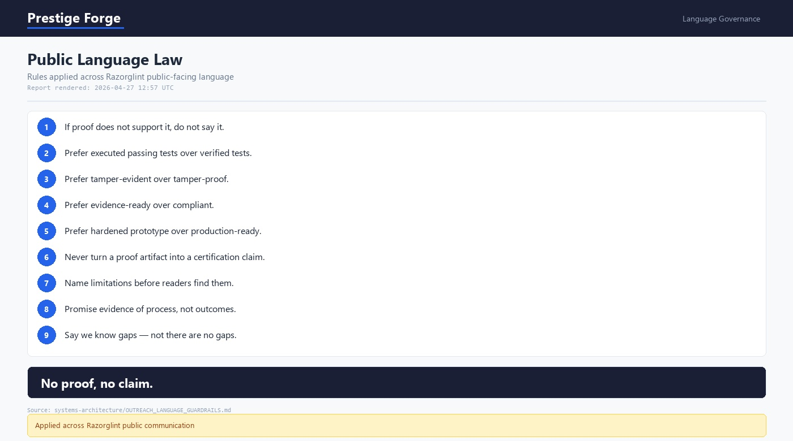

# Prestige Forge

**Turn your project claims into verifiable proof.**

Prestige Forge produces sealed proof bundles — per-check evidence, cryptographic proofs, and run manifests bound to git commits. Offline. Deterministic. Stdlib-only proof engine (Flask for UI).

---

## Product Ladder

### Free — Proof Visibility

See your proof state. Badge and proof summary, verification history, structural self-check, and vault audit. Runs offline with stdlib-only Python. No accounts, no cloud. The local UI requires Flask.

### Paid Tier 1 — Trust Transfer

Share proof without sharing code. Generate a shareable proof report for buyers, auditors, or stakeholders — includes artifact references, workflow summaries, and verification instructions. The receiver can verify without source access.

### Paid Tier 2 — Claims Safety

Know what you can safely say. Compare declared claims against current proof state. Get per-claim verdicts: SAFE TO SAY, UNSAFE TO SAY, or PARTIALLY SUPPORTED. Fix First ranking shows exactly which claims to address first. Temporal drift detection catches when proof degrades over time.

---

## We Run It On Ourselves

Prestige Forge verified its own claims using its own engine. 15 claims declared. 25 proof checks executed. Result: 15/15 SAFE TO SAY, 0 UNSAFE. The claims safety report we use internally is the same one customers receive.

See [Client Zero results](docs/client-zero.md) for the full self-verification record.

---

## External Verification

### click — public open-source library

Prestige Forge was run against `pallets/click` without modifying source files.

- Claims evaluated: 7
- SAFE TO SAY: 6/7
- UNSAFE TO SAY: 1/7
- Fix First flagged the deliberately unbacked claim

This shows Prestige Forge can produce clean support where proof exists, while still refusing unsupported claims.

---

## Internal Razorglint Use

Prestige Forge is no longer only a self-verification demo.

It has been used internally by Razorglint Labs to check public-facing claim language across systems-architecture, Command Guardian, FleetSim, LinkedIn/outreach wording, and buyer-facing proof material.

This internal use produced claim safety packs, approved/forbidden claim lists, required qualifiers, outreach guardrails, and proof-backed public language.

This does not claim customer deployment, third-party validation, certification, or legal compliance. It shows that Prestige Forge is already being used for the job it was built to do: preventing unsupported public claims before publication.

### Client Zero — Self-Verification

### Systems Architecture — 78 Claims Audited

### Unsafe Claim Firewall

### Command Guardian — Post-Remediation Claim Safety

### FleetSim — Evidence Scoping

### Public Language Law

See [Internal Use Proof Manifest](assets/proof/PRESTIGE_FORGE_INTERNAL_USE_PROOF_MANIFEST.md) for source artifacts and non-claims.

---

## Version

**0.1.0 — Source Release**

- 798 tests passing
- Proof engine: stdlib-only Python, zero external dependencies
- Local UI: requires Flask
- Full product ladder: free proof visibility + paid trust transfer + paid claims safety
- Local UI included
- Python 3.11+ stdlib only (Flask for UI layer)

---

## Documentation

| Document | Purpose |
|----------|---------|
| [Quickstart](docs/quickstart.md) | Get running in under five minutes |
| [Tier Overview](docs/tier-overview.md) | Detailed breakdown of free and paid tiers |
| [Client Zero](docs/client-zero.md) | Self-verification proving run results |
| [Local UI Preview](docs/local-ui-preview.md) | Browser-based local interface for proof operations |
| [Examples](examples/) | Per-tier example artifacts |

---

## License

Proprietary. © 2026 TCOG Collective LLC / Razorglint Labs. All rights reserved. See [LICENSE](LICENSE) for details.
