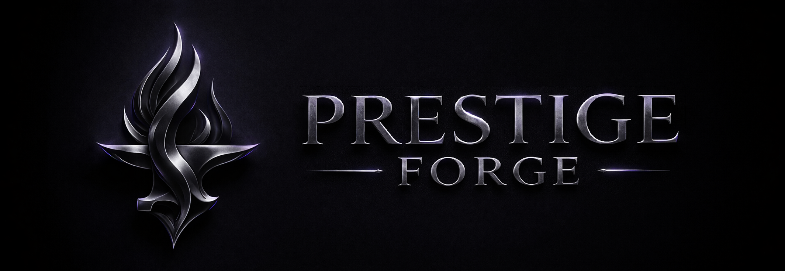
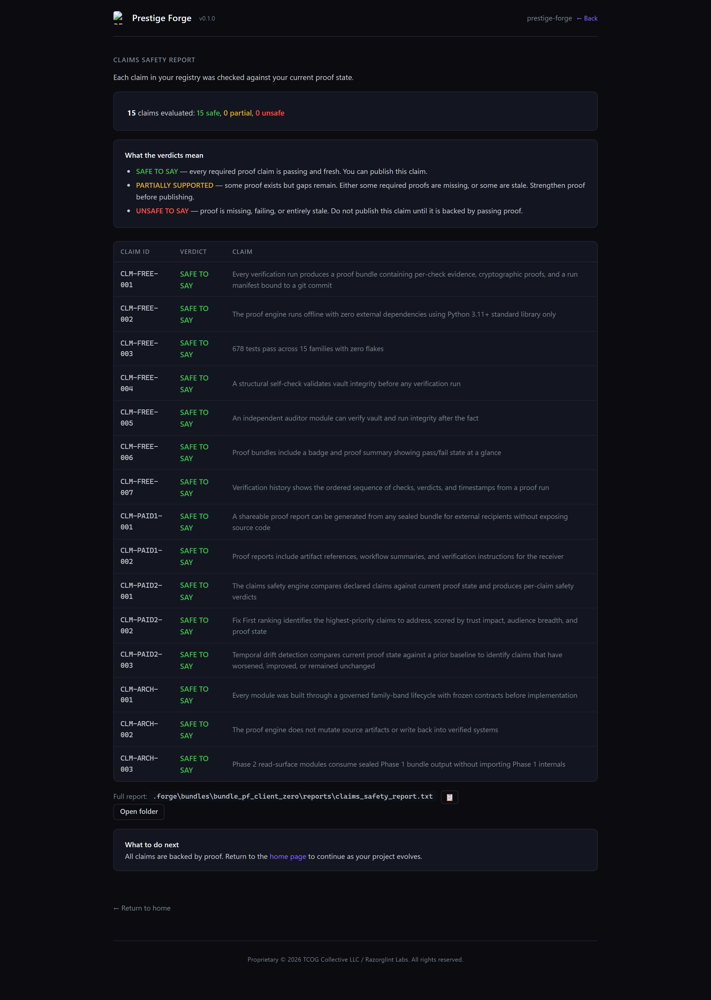
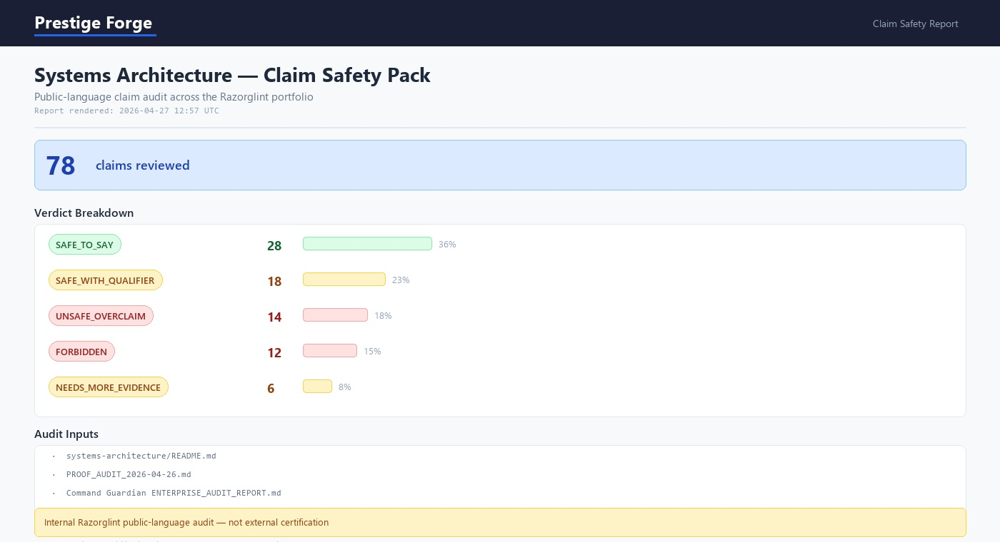
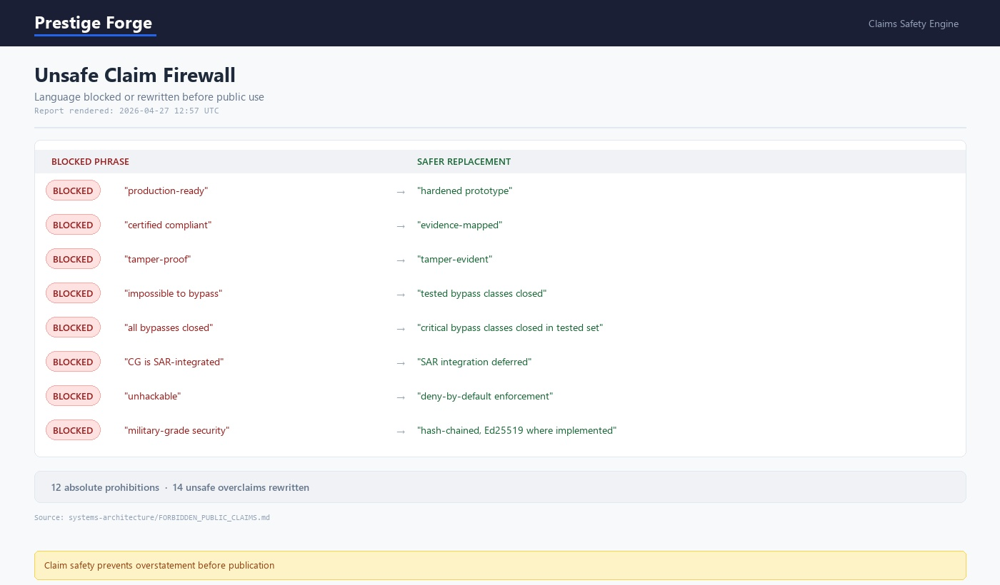
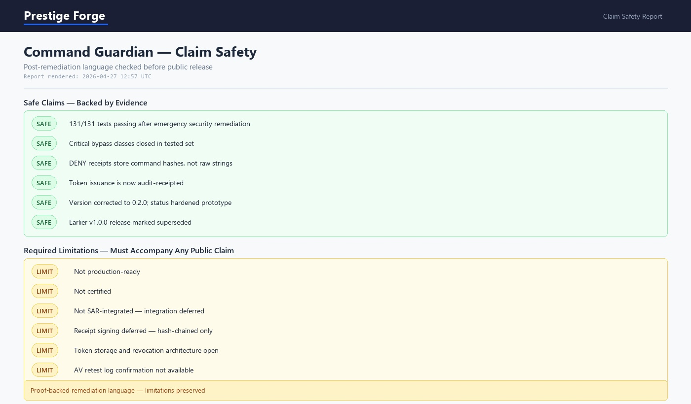
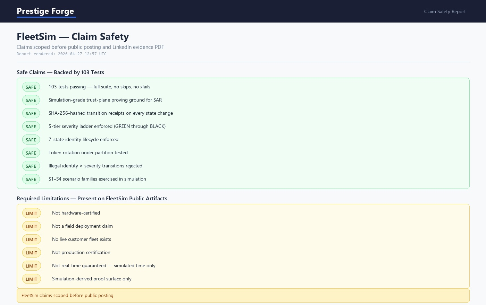
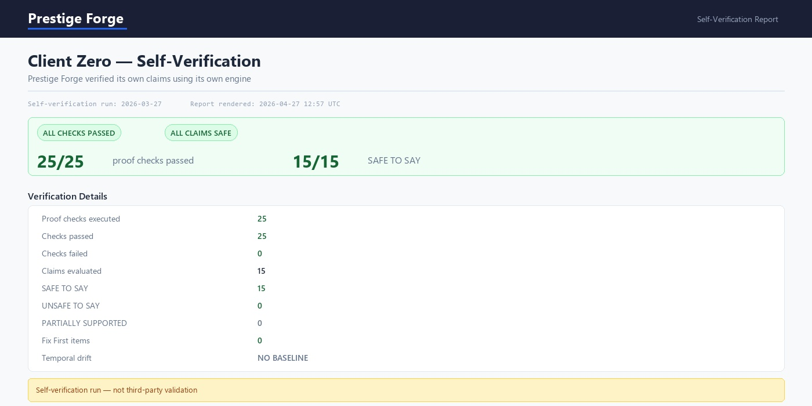
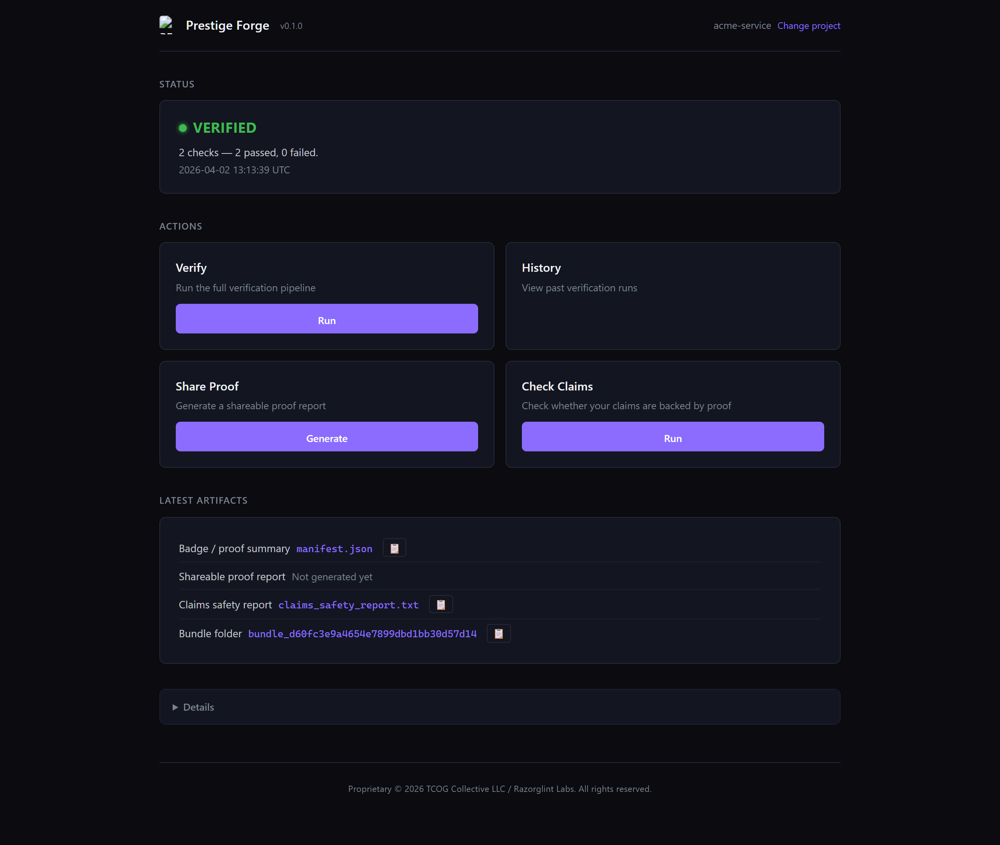

<p align="center">
  
</p>


> **Check what you can safely say — before it ships.**

<h1 align="center">Prestige Forge</h1>

<p align="center">
  <strong>Proof-first claim-safety for public claims, buyer decks, audit material, and evidence packs.</strong><br>
  <em>Check what you can safely say — before it ships.</em>
</p>

<p align="center">
  
  
  
  
  
</p>

---

Prestige Forge is a proof-first claim-safety engine. It compares system claims against available evidence and returns buyer-safe verdicts:

- **SAFE TO SAY** — fully backed by evidence
- **SAFE WITH QUALIFIER** — supported, but requires stated limitation
- **UNSAFE / OVERCLAIM** — evidence does not support this claim
- **FORBIDDEN** — absolute prohibition, no safe rewrite possible
- **NEEDS MORE EVIDENCE** — plausible but insufficiently backed

It is designed for teams preparing public posts, buyer decks, audit evidence, launch pages, investor materials, and governance documentation — anywhere unsupported claims create risk.



---

## What It Catches

| Unsafe claim | Safer replacement |
|---|---|
| "production-ready" | "hardened prototype" / "pilot-ready" (if supported) |
| "certified compliant" | "evidence-mapped" / "readiness-oriented" |
| "tamper-proof" | "tamper-evident" |
| "all bypasses closed" | "tested bypass classes closed" |
| "deployed in the wild" | "internally tested" / "simulation-grade" / "pilot-ready" |
| "verified truth" | "evidence-backed claim verdict" |

This is claim safety — not legal review, not certification, not compliance theater. The engine maps claims to evidence and tells you what the proof actually supports.

---

## Try It Locally in 2 Minutes

Prestige Forge includes a small offline sample tester. It checks sample claims against sample evidence and writes a timestamped mini truthpack with verdicts, qualifiers, safer rewrites, a manifest, and SHA-256 checksums.

```bash
cd examples/try-this-2-minutes
python run_sample.py
```

No external dependencies. Python 3.11+ stdlib only. Each run produces a fresh timestamped output folder.

See [examples/try-this-2-minutes/](examples/try-this-2-minutes/) for the full sample, expected verdicts, and an example output snapshot.

---

## Internal Razorglint Use

Prestige Forge is no longer only a self-verification demo.

It has been used internally by Razorglint Labs to check public-facing claim language across systems-architecture, Command Guardian, FleetSim, LinkedIn/outreach wording, and buyer-facing proof material.

This internal use produced claim safety packs, approved/forbidden claim lists, required qualifiers, outreach guardrails, and proof-backed public language.

This does not claim customer deployment, third-party validation, certification, or legal compliance. It shows Prestige Forge being used for the job it was built to do: preventing unsupported public claims before publication.

### Systems Architecture — 78 Claims Audited



### Unsafe Claim Firewall — 12 Prohibitions, 14 Overclaims Rewritten



### Command Guardian — Post-Remediation Claim Safety



### FleetSim — Evidence Scoping Before Public Post



See the full set — including Client Zero self-verification, Public Language Law, and summary — in the [Internal Use Proof Manifest](assets/proof/PRESTIGE_FORGE_INTERNAL_USE_PROOF_MANIFEST.md).

---

## Client Zero — Self-Verification

Prestige Forge verified its own claims using its own engine. 15 claims declared. 25 proof checks executed. Result: **15/15 SAFE TO SAY, 0 UNSAFE.**

The same engine and report format used for this self-verification is available to buyers evaluating their own claims.

See [Client Zero results](docs/client-zero.md) for the full self-verification record.



---

## Open-Source Library Example

### click — public open-source library

Prestige Forge was run against the public open-source `pallets/click` repository without modifying source files.

- Claims evaluated: 7
- SAFE TO SAY: 6/7
- UNSAFE TO SAY: 1/7
- Fix First flagged the deliberately unbacked claim

This shows Prestige Forge can produce clean verdicts where proof exists, while still refusing unsupported claims.

---

## Who This Is For

| Use case | What Prestige Forge does |
|---|---|
| **Public posts / LinkedIn** | Checks draft claims against evidence before posting |
| **Buyer decks** | Flags overclaims before they reach due diligence |
| **Audit evidence packs** | Maps claims to proof artifacts, names gaps |
| **Launch pages** | Prevents "certified" / "compliant" / "production-ready" overreach |
| **Governance documentation** | Ensures stated capabilities match tested evidence |
| **Internal remediation** | Produces approved wording after security fixes or version corrections |

---

## What Prestige Forge Does NOT Claim

- It is not a legal compliance engine.
- It is not a certification authority.
- It does not replace counsel, auditors, or regulators.
- It does not prove a system is production-ready.
- It does not create evidence that does not exist.
- It does not make unsafe claims safe by rewriting them.
- It only helps map claims to available evidence and produce safer public language.

No customer deployment claim. No third-party validation claim. No certification claim.

---

## Product Tiers

### Free — Proof Visibility

See your proof state. Badge and proof summary, verification history, structural self-check, and vault audit. Runs offline with stdlib-only Python. No accounts, no cloud. The local UI requires Flask.

### Paid Tier 1 — Trust Transfer

Share proof without sharing code. Generate a shareable proof report for buyers, auditors, or stakeholders — includes artifact references, workflow summaries, and verification instructions. The receiver can verify without source access.

### Paid Tier 2 — Claims Safety

Know what you can safely say. Compare declared claims against current proof state. Get per-claim verdicts: SAFE TO SAY, UNSAFE TO SAY, or PARTIALLY SUPPORTED. Fix First ranking shows which claims to address first. Temporal drift detection catches when proof degrades over time.

See [Tier Overview](docs/tier-overview.md) for detailed breakdown and comparison.

---

## Commercial Options

Prestige Forge can support:

- Local proof-engine evaluation
- Paid claim-safety review packages
- White-label / OEM integration discussions
- Internal governance language checks
- Evidence-readiness pilots

Pricing depends on scope, artifact volume, integration level, and whether the buyer needs reports, local tooling, or licensing.

Contact **razorglint.ops@protonmail.com** to discuss.

---

## Local UI



A browser-based local interface for proof operations. Runs on your machine — no cloud, no accounts, no telemetry. See [Local UI Preview](docs/local-ui-preview.md).

---

## Current Status

**Internal-use validated claim-safety engine.** Buyer-facing proof surface available. Local sample / pilot package preparing.

- 798 tests passing (proof engine + local UI)
- Proof engine: stdlib-only Python 3.11+
- Local UI: requires Flask
- Three-tier product ladder: free proof visibility + paid trust transfer + paid claims safety

This is not production-certified. This is not customer-deployed. This is a working claim-safety engine with internal proof-of-use across the Razorglint portfolio.

---

## Documentation

| Document | Purpose |
|----------|---------|
| [Quickstart](docs/quickstart.md) | Get running in under five minutes |
| [Tier Overview](docs/tier-overview.md) | Detailed breakdown of free and paid tiers |
| [Client Zero](docs/client-zero.md) | Self-verification proving run results |
| [Local UI Preview](docs/local-ui-preview.md) | Browser-based local interface for proof operations |
| [Examples](examples/) | Per-tier example artifacts |
| [Internal Use Proof Manifest](assets/proof/PRESTIGE_FORGE_INTERNAL_USE_PROOF_MANIFEST.md) | Source artifacts and non-claims for proof images |

---

## License

Proprietary. © 2026 TCOG Collective LLC / Razorglint Labs. All rights reserved. See [LICENSE](LICENSE) for details.
