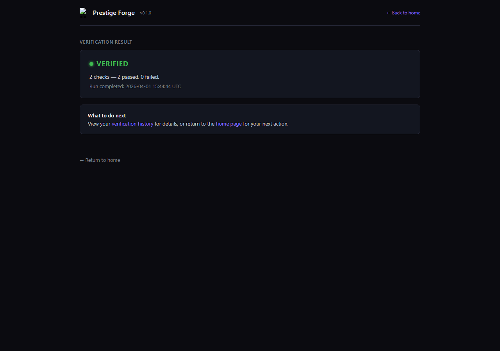

# Local UI Preview

## What this is

Prestige Forge now includes a local UI — a browser-based interface that runs on your machine. Instead of working entirely through the terminal, you can launch a local session and interact with the verification engine directly through your browser.

This is an early MVP. It is functional, tested, and available now.

---

## Why it matters

Prestige Forge was built as a proof engine first. The engine is solid, but using it required comfort with the command line.

The local UI reduces that friction. It gives you a visual surface for the same proof operations — without changing how the engine works underneath. The proofs, bundles, and verdicts are identical. The difference is how you interact with them.

---

## What you can do today

The local UI supports four core actions:

### Verify

Run a full verification pass against your project. The engine executes all configured checks, captures evidence, mints proofs, and assembles a sealed bundle. You see the result in your browser — pass or fail, proof counts, and a summary of what was checked.

### History

View your verification history — an ordered timeline of past runs, showing when each check ran and what it found.

### Share Proof

Generate a shareable proof report from a sealed bundle. This produces a structured document that a buyer, auditor, or stakeholder can inspect independently, without needing your source code.

### Check Claims

Run the claims safety engine against your declared claims. Each claim gets a verdict: SAFE TO SAY, UNSAFE TO SAY, or PARTIALLY SUPPORTED. You also see the Fix First list — which claims to address first, ranked by how much trust damage they carry.

### Tier gating

Some actions require a paid tier. Free-tier users can verify and view history. The UI shows all four actions, but locked actions explain clearly what they do and why they require an upgrade.

---

## What click-and-run means in practice

You launch Prestige Forge locally. Your browser opens. You see your current proof state, pick an action, and get a result — without writing commands or reading terminal output.

The experience is designed to be:

- **Direct** — no setup wizard, no account creation, no cloud services
- **Local** — everything runs on your machine, nothing leaves your network
- **Proof-first** — same sealed bundles, same cryptographic proofs, same verdicts as the command line

This is not a dashboard. It is a working verification surface that talks directly to the proof engine.

---

## What is intentionally not included yet

- **GitHub-native integration** — the local UI runs in your browser, not inside GitHub. GitHub integration is a future direction, not a current feature.
- **Hosted experience** — there is no cloud version. The UI is local-only.
- **Real-time monitoring** — this is a run-and-read flow, not a live status board.
- **Multi-project management** — you work with one workspace at a time.
- **Report customization** — proof reports and claims reports follow the standard format.

These are known boundaries, not missing features. The local UI is scoped to do a specific set of things well.

---

## What comes later

The roadmap direction includes:

- **GitHub-native convenience** — making proof visibility available where code already lives, without requiring a separate local launch
- **Richer artifact display** — better formatting and navigation for proof reports and claims results
- **Workspace memory** — remembering your last workspace and configuration between sessions

These are directional, not commitments. The current MVP is what ships today.

---

[Back to main README](../README.md) | [Tier overview](tier-overview.md) | [Client Zero](client-zero.md)
